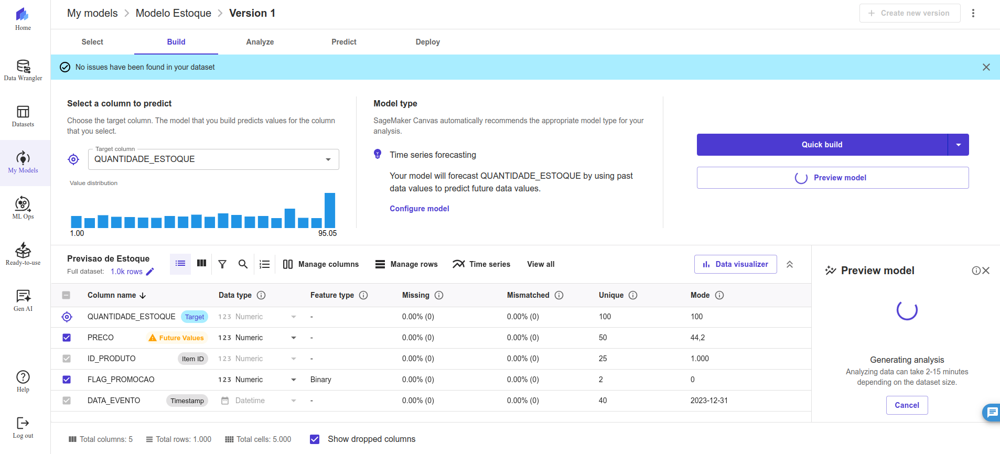
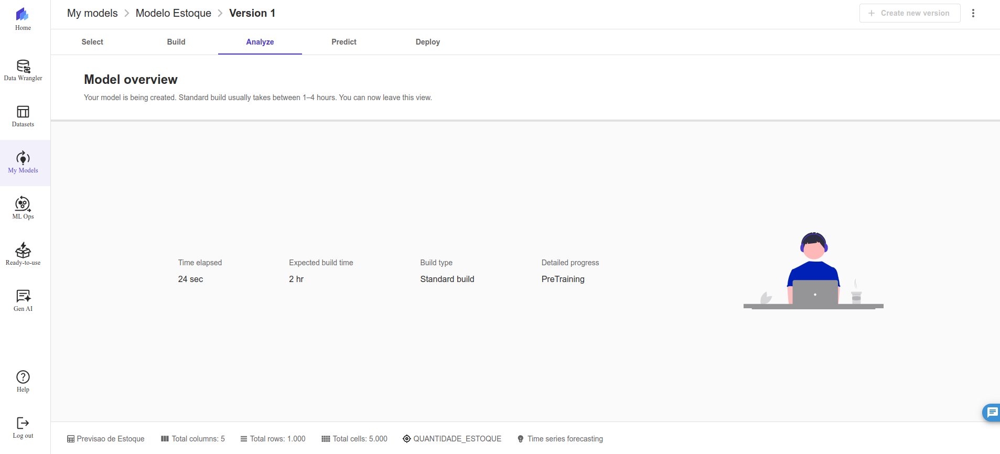
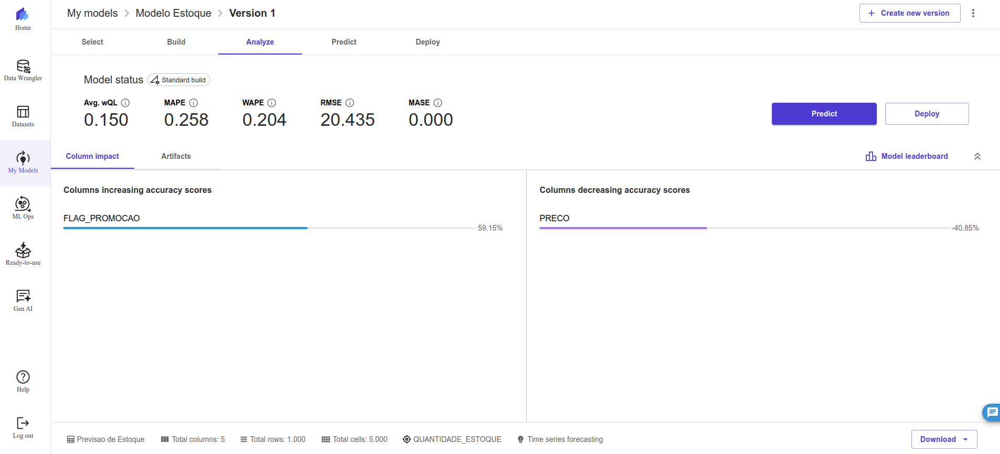
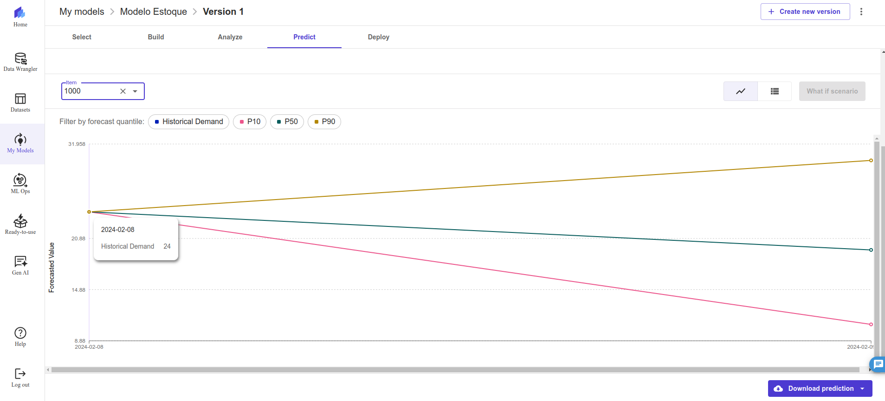
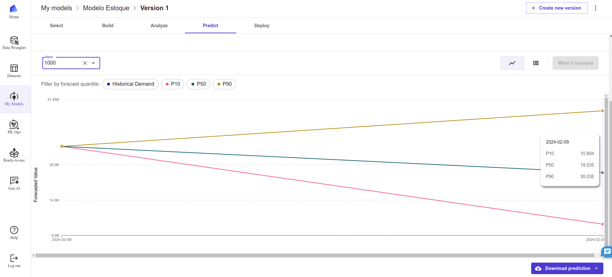

# 📊 Previsão de Estoque Inteligente na AWS com [SageMaker Canvas](https://aws.amazon.com/pt/sagemaker/canvas/)

Neste Lab DIO, foi utilizado o SageMaker Canvas para criar previsões de estoque baseadas em Machine Learning (ML). Os passos seguidos estão detalhados abaixo.

## 📋 Pré-requisitos

Para utilizar o [SageMaker Canvas](https://aws.amazon.com/pt/sagemaker/canvas/), é necessário ter uma conta na AWS. Se precisar de ajuda para criar sua conta, confira o repositório da DIO: [AWS Cloud Quickstart](https://github.com/digitalinnovationone/aws-cloud-quickstart).

## 🎯 Objetivos Deste Desafio de Projeto (Lab)

## 🚀 Passo a Passo

### 1. Dataset
 
O dataset analisado fornece uma visão detalhada sobre o comportamento de produtos em um intervalo de tempo específico, abrangendo desde 31 de dezembro de 2023 até 12 de janeiro de 2024. Cada registro no dataset é composto por cinco campos principais: ID_PRODUTO, DATA_EVENTO, PRECO, FLAG_PROMOCAO e QUANTIDADE_ESTOQUE.

O campo ID_PRODUTO identifica unicamente cada item, com valores que vão de 1000 a 1024. Este identificador é essencial para distinguir entre os diferentes produtos listados. A DATA_EVENTO registra a data específica em que os dados foram coletados, no formato YYYY-MM-DD. A variação nas datas permite a análise dos produtos em diferentes dias e a observação de tendências temporais.

O campo PRECO indica o preço do produto em reais, e varia significativamente, refletindo a diversidade de preços entre os produtos e possíveis ajustes ao longo do período analisado. A FLAG_PROMOCAO é um indicador binário que mostra se o produto estava em promoção naquele dia. Um valor de 1 significa que o produto estava em promoção, enquanto 0 indica ausência de promoção. Este campo é crucial para entender a relação entre promoções e variações de preços.

A QUANTIDADE_ESTOQUE mostra o número de unidades disponíveis de cada produto em estoque no dia do evento. As variações neste campo fornecem insights sobre a demanda dos produtos e a eficácia das estratégias de estoque. Produtos em promoção geralmente apresentam níveis de estoque mais baixos, sugerindo um impacto positivo das promoções nas vendas e na redução do inventário.

Em resumo, o dataset oferece informações valiosas para analisar como preços, promoções e níveis de estoque variam ao longo do tempo, permitindo que as empresas ajustem suas estratégias de vendas e gestão de inventário com base nos padrões observados.

O tipo de modelo escolhido foi o de análise preditiva (Predictive analysis). Em seguida, foi criado o dataset no SageMaker Canvas e feito o upload do dataset escolhido. 

    

### 2. Construção/Treinamento

 Em seguida, foram configuradas as variáveis de ambiente. A variável escolhida para ser analisada foi a QUANTIDADE_ESTOQUE.

 

Iniciado o treinamento do modelo. Foi escolhido o Standard build, a fim de obter um modelo mais preciso.

### 3. Análise

Após o treinamento, foram obtidas as métricas de performance do modelo. 

1. Avg.wQL (Average Weighted Quantile Loss): 0.15: O valor de 0.15 para a Avg.wQL indica que, em média, a perda ponderada dos quantis é relativamente baixa. Isso sugere que as previsões do modelo são bastante precisas em diferentes quantis do estoque. A baixa perda média ponderada é um sinal positivo, pois indica que o modelo está conseguindo manter uma boa precisão na previsão dos diferentes níveis de estoque.

2. MAPE (Mean Absolute Percentage Error): 0.258: Um MAPE de 0.258, ou 25.8%, sugere que, em média, há um erro percentual de cerca de 25.8% entre as previsões e os valores reais da QUANTIDADE_ESTOQUE. Esse valor indica que, embora o modelo esteja relativamente próximo dos valores reais, ainda existe uma margem significativa de erro. Dependendo do contexto e da importância da precisão das previsões de estoque, pode ser necessário considerar melhorias no modelo para reduzir esse erro percentual.

3. WAPE (Weighted Absolute Percentage Error): 0.204: Com um WAPE de 0.204, ou 20.4%, as previsões apresentam um erro percentual absoluto médio ponderado em relação aos valores reais. Este valor é um pouco menor que o MAPE, sugerindo que o modelo pode estar ajustando melhor os erros mais críticos, especialmente se houver ponderações específicas que tornem certos níveis de estoque mais importantes. Um WAPE inferior ao MAPE é um sinal de que o modelo pode estar mais bem ajustado para as variações de estoque que são mais relevantes.

4. RMSE (Root Mean Squared Error): 20.435: O RMSE de 20.435 indica que, em média, a raiz quadrada do erro quadrático médio das previsões de QUANTIDADE_ESTOQUE é 20.435. Este valor revela que há variação considerável nos erros de previsão, e o modelo está penalizando os grandes desvios de forma significativa. Um RMSE relativamente alto pode apontar a necessidade de melhorar o modelo para reduzir a magnitude dos erros maiores.

5. MASE (Mean Absolute Scaled Error): 0.000: Um MASE de 0.000 sugere que o modelo está apresentando um erro absoluto médio muito abaixo do erro de um modelo de referência simples, como uma média móvel. Esse resultado extremamente baixo indica que o modelo está significativamente melhor do que o modelo de referência básico, sendo muito eficaz na previsão da QUANTIDADE_ESTOQUE.

Em resumo, os valores indicam que o modelo tem uma boa performance geral, especialmente considerando o MASE que sugere uma grande vantagem sobre o modelo de referência. No entanto, o MAPE e o RMSE mostram que há espaço para melhorar a precisão das previsões, especialmente reduzindo os erros percentuais e a variação dos erros. Ajustes adicionais no modelo podem ajudar a diminuir o MAPE e o RMSE, tornando as previsões mais confiáveis para a gestão de estoque.

### 4. Previsão

O modelo treinado foi utilizado para fazer previsões de estoque. Ao escolher um dos itens do estoque como exemplo, foi obtido o gráfico da figura abaixo:

- A demanda histórica desse produto é de 24. 
- Três percentis mostram as perspectivas: p10, p50 e p90.
- O p10 mostra uma perspectiva pessimista, onde a quantidade desse produto cai para 10.
- O p50 mostra uma perspectiva em que essa quantidade se mantém aproximadamente igual, em torno de 19.
- O p90 mostra uma perspectiva otimista, com a quantidade subindo para 30.

Essas perspectivas ajudam a analisar o cenário e tomar decisões mais asserivas.

